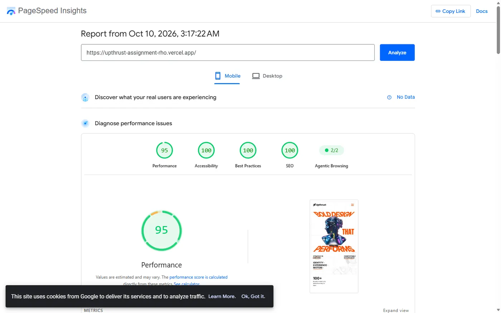
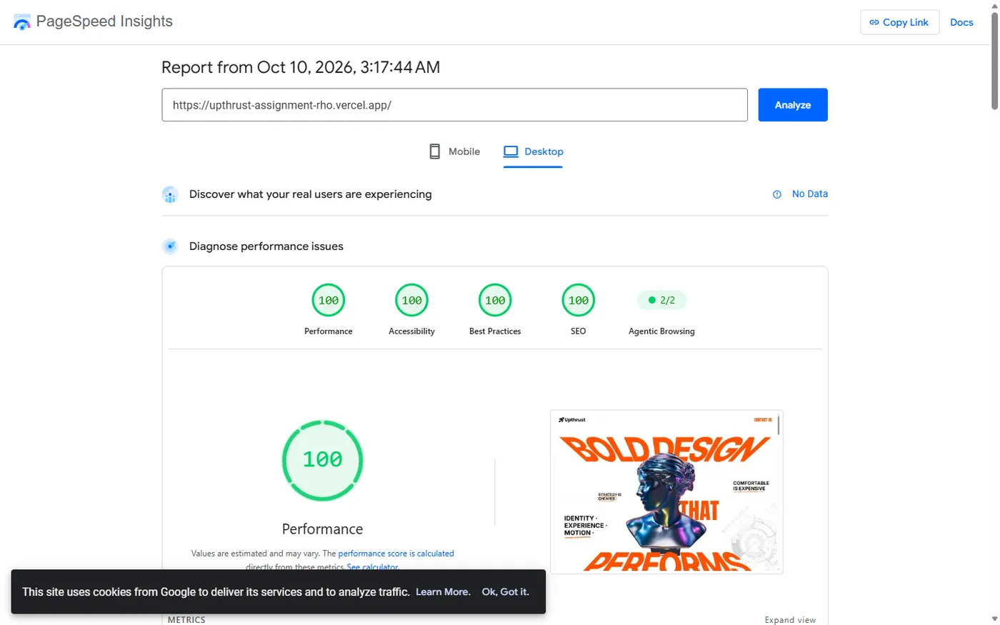
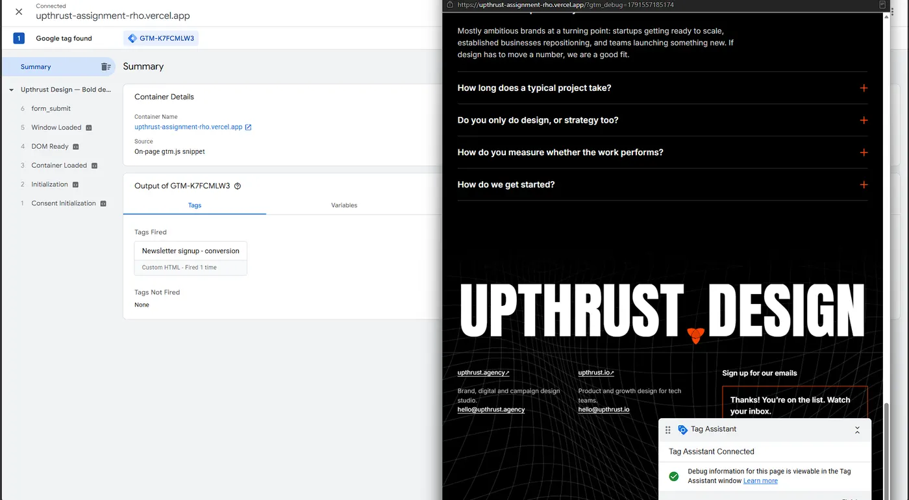
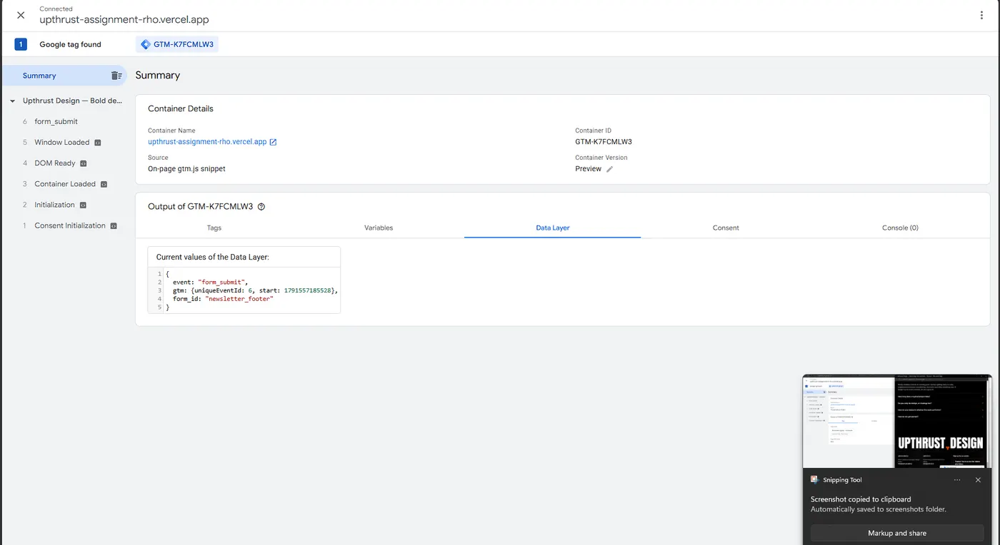
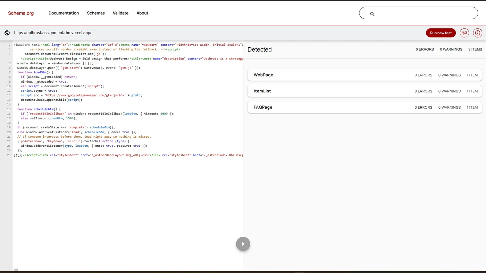
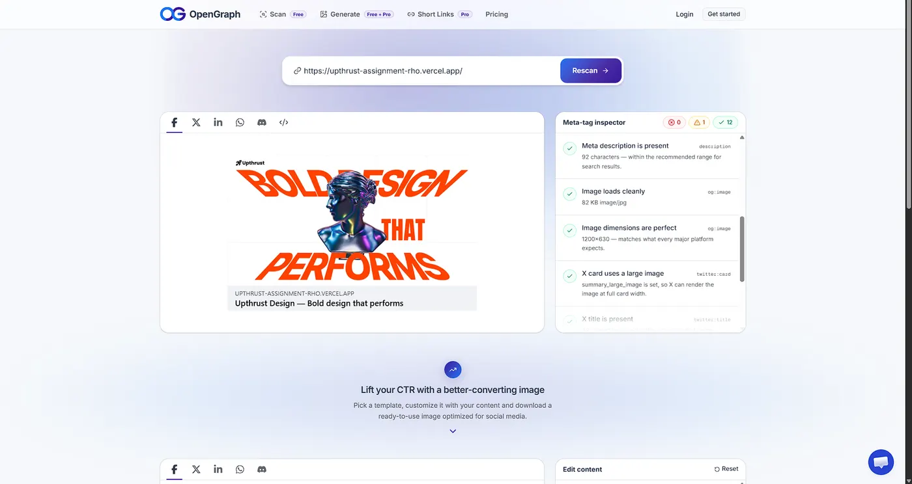
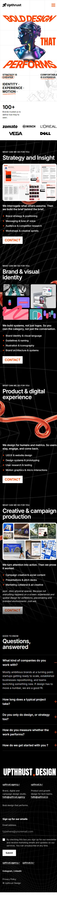

# Upthrust: landing page

Production build of the Upthrust landing page from the supplied Figma design and assets: Astro, Tailwind and GSAP on the front end, Sanity as the CMS, a Vercel serverless function with Supabase for the newsletter form, and Google Tag Manager for tracking.

## Links

| | |
|---|---|
| **Live site** | https://upthrust-assignment-rho.vercel.app |
| **Repository** | https://github.com/gamea333/upthrust_assignment |
| **CMS (Sanity Studio)** | https://upthrust-design.sanity.studio (login required) |
| **PageSpeed: mobile** | [95 / 100 / 100 / 100](https://pagespeed.web.dev/analysis/https-upthrust-assignment-rho-vercel-app/x99ar385e5?form_factor=mobile) (Performance / Accessibility / Best Practices / SEO) |
| **PageSpeed: desktop** | [100 / 100 / 100 / 100](https://pagespeed.web.dev/analysis/https-upthrust-assignment-rho-vercel-app/x0id8lwfoj?form_factor=desktop) |
| **Structured data** | [Schema.org validator](https://validator.schema.org/#url=https%3A%2F%2Fupthrust-assignment-rho.vercel.app%2F) · [Google Rich Results Test](https://search.google.com/test/rich-results?url=https%3A%2F%2Fupthrust-assignment-rho.vercel.app%2F) |
| **Social preview (Open Graph)** | [opengraph.xyz](https://www.opengraph.xyz/url/https%3A%2F%2Fupthrust-assignment-rho.vercel.app%2F) |
| **Google Tag Manager** | Container `GTM-K7FCMLW3` (verified with Tag Assistant, see below) |
| **Form submissions** | Supabase table `newsletter_signups` (shown live; the dashboard is private) |

PageSpeed scores move a few points between runs. Mobile has scored 93–97 in every run since launch, against a target of 85.

| Mobile PageSpeed | Desktop PageSpeed |
|---|---|
|  |  |

## Stack and why

| Layer | Choice | Why |
|---|---|---|
| Framework | **Astro 7** (static output, TypeScript) | It's a content page, so it ships as pre-rendered HTML with almost no JS by default. All content is in the HTML for SEO, and the page loads fast. Only the form endpoint runs on the server. |
| Styling | **Tailwind CSS v4** + scoped component CSS | Design tokens (colours, fonts, breakpoints) live in one `@theme` block. Complex layouts are written as plain CSS next to their component. |
| Motion | **GSAP + ScrollTrigger**, **Lenis**, **three.js** | GSAP pins the services section and scrolls it sideways, Lenis smooths desktop scrolling, and three.js renders the supplied 3D models live. All of it is desktop-only and lazy-loaded. |
| CMS | **Sanity** | A headless CMS with a structured content model and an editor-friendly Studio. The site reads it at build time, so there's no CMS cost at page load. |
| Backend | **Vercel serverless function** + **Supabase (Postgres)** | One endpoint, `/api/subscribe`, validates the form and stores it in a locked-down table. Supabase gives a real database with a table viewer to demonstrate. |
| Tracking | **Google Tag Manager** | The site pushes events to the dataLayer, and marketing configures tags in GTM without code changes. |
| Hosting | **Vercel** | Preview deployments for every PR and production deploys from `main`. |

**Trade-offs considered**
- **Next.js** would also work, but it ships a React runtime this page doesn't need. Astro's static-first output made the performance target easy to hit.
- **Live 3D** was the riskiest choice. The pre-rendered images always load first and are what PageSpeed measures; the 3D is an enhancement layered on top.
- **Formspree or Netlify Forms** would be quicker, but they're a black box. A real endpoint and database show how forms are actually processed.

## Project structure

```
src/
  pages/
    index.astro            the landing page
    privacy.astro, 404.astro
    api/subscribe.ts       POST /api/subscribe (the only server route)
  components/              Header, Hero, Services, Testimonials, Faq, Footer,
                           SignupForm, Seo, GoogleTagManager
  layouts/BaseLayout.astro <head>, skip link, global scripts
  lib/
    sanity.ts, content.ts  CMS query and content loading (with fallback)
    supabase.ts            server-only database client
    rate-limit.ts          per-IP limit for the form endpoint
    structured-data.ts     JSON-LD built from the CMS content
    grid.ts                responsive background images
  scripts/                 client scripts: signup form, motion (GSAP/Lenis),
                           scroll reveals, 3D statue and tube, 3D load queue
  content/site.ts          bundled fallback copy (used only if Sanity is down)
  styles/global.css        Tailwind theme, tokens, shared motion styles
  assets/                  design SVGs and images (optimised at build time)
public/                    favicons, OG image, robots.txt, compressed 3D models
studio/                    Sanity Studio: schema, desk structure, seed script
supabase/schema.sql        table definition and permissions
```

## Running locally

```bash
npm install
cp .env.example .env        # fill in the Supabase values (see below)
npm run dev                 # http://localhost:4321
npm run preview:prod        # production build at http://localhost:4322 (real speed)
npm run check               # TypeScript and Astro diagnostics
```

Studio: `cd studio && npm install && npm run dev` (http://localhost:3333).

## Editing content (CMS)

Content lives in Sanity. An editor logs into **https://upthrust-design.sanity.studio**, changes something and clicks **Publish**. A Sanity webhook calls a Vercel deploy hook, and the live site rebuilds with the change in about a minute.

| Studio section | Controls |
|---|---|
| Site settings | Page title, meta description, social share image, section headings |
| Hero | H1 text, the two hand-marked notes, capabilities list, "100+" proof line |
| Client logos | Logo strip (add, remove, drag to reorder) |
| Services | The four panels: title, intro, bullets, note, collage image and alt text |
| FAQs | Questions and answers (also feed the FAQ structured data) |
| Testimonials | Client quotes; the section appears on the page once one is published |
| Footer | Wordmark, site links, tagline, newsletter form copy, social links |

**Content model.** Site settings, Hero and Footer are single documents that can't be duplicated or deleted. Logos, Services, FAQs and Testimonials are lists ordered by drag and drop. The site fetches everything in **one GROQ query at build time** (`src/lib/sanity.ts`). If Sanity is unreachable or a section is empty, that section falls back to `src/content/site.ts`, so a deploy never ships a blank page. CMS images are downloaded and optimised (AVIF/WebP, responsive sizes) exactly like local ones.

## Form handling and tracking

```
Footer form ──► client validation ──► POST /api/subscribe (Vercel function)
                                         ├─ honeypot field (silently drops bots)
                                         ├─ rate limit: 5 requests / minute / IP
                                         ├─ Zod validation (email, consent)
                                         └─ insert into Supabase newsletter_signups
             ◄── 200 OK ── success state + dataLayer.push({ event: 'form_submit' })
```

- **Validation:** client side (on blur and on submit, with inline errors) and again on the server.
- **Success state:** a spinner while sending, then an animated success message.
- **Storage:** Supabase Postgres. The table has Row Level Security on with no public policies, so only the server, using its secret key, can insert. A duplicate email counts as success, so the form doesn't reveal who is already subscribed.
- **Tracking:** the required **`form_submit`** event is pushed **only after the server returns 200**. The form also pushes `form_start` (first interaction) and `form_error` (validation, server or network failure, with the reason) for funnel analysis. Every event includes `form_id: newsletter_footer`.
- **GTM:** a Custom Event trigger on `form_submit` fires the conversion tag. GTM loads after the page has finished loading, so it doesn't affect Core Web Vitals.

**Verifying tracking:**
1. Open GTM, click **Preview** and connect to the live site.
2. Submit the form.
3. In Tag Assistant, `form_submit` appears with the tag fired and the dataLayer payload.

You can also type `dataLayer` in the browser console after submitting.

| Tag fired on `form_submit` | dataLayer payload |
|---|---|
|  |  |

## Integrations and environment variables

| Service | Used for | Configured in |
|---|---|---|
| Vercel | Hosting, previews, serverless function | Git integration; env vars in Vercel → Settings → Environments |
| Sanity | CMS content and images | `studio/`; project `1rk7384s`, dataset `production` (public read) |
| Sanity → Vercel webhook | Rebuild on publish | Sanity API webhook → Vercel deploy hook (secret URL, not in the repo) |
| Supabase | Form storage | `supabase/schema.sql`; URL and secret key in env vars |
| Google Tag Manager | Event tracking | Container `GTM-K7FCMLW3` |

Environment variables are declared with Astro's typed `astro:env` schema (`astro.config.mjs`):
- `SUPABASE_URL` and `SUPABASE_SERVICE_ROLE_KEY` are **server-only secrets**. Astro refuses to import them into client code, they're read at runtime, and they're set in `.env` locally and in Vercel for Production and Preview.
- `PUBLIC_GTM_ID`, `PUBLIC_SANITY_PROJECT_ID` and `PUBLIC_SANITY_DATASET` are public values with safe defaults.

`.env` is git-ignored; `.env.example` lists every variable. No secrets are in the repository or its history.

## Performance, SEO and accessibility

**Performance**
- The hero image is the LCP element: AVIF/WebP, responsive sizes, high fetch priority.
- Everything below the fold is lazy-loaded, and background images load only when near the viewport.
- Fonts are self-hosted.
- The animation libraries (GSAP, Lenis) load **only on desktop**. Phones download about 3 KB of page JS.
- The 3D models are compressed with meshopt: 1.6 MB to 94 KB (tube) and 153 KB (statue). three.js loads only on desktop, after the first interaction, sets up when the page is idle, compiles shaders in the background, renders only while visible, and lowers resolution on slow GPUs.
- GTM loads after the page has finished loading.

**SEO**
- Unique title and description, editable in the CMS.
- **Exactly one H1** with an H2/H3 hierarchy.
- Canonical URL, Open Graph and Twitter card with a 1200×630 image.
- **JSON-LD:** Organization, WebSite, WebPage, Services list and FAQPage, generated from the same CMS content as the page.
- Sitemap and robots.txt; the 404 page is `noindex`.
- All content is in the server-rendered HTML.

**Accessibility**
- Skip link, semantic landmarks, alt text on every meaningful image (decorative images are hidden).
- Visible focus rings; all interactions work by keyboard.
- The mobile menu traps focus, closes on Esc and returns focus to its button.
- Labelled form fields, with errors linked to their inputs and announced.
- Readable contrast.
- `prefers-reduced-motion` turns off every animation and all 3D.

| SEO structured data | Social share preview |
|---|---|
|  |  |

## Responsive behaviour and design decisions

The Figma file is desktop-only, so the tablet and mobile layouts are my own adaptations of it:

- **Desktop:** the services section is pinned and the four panels scroll sideways along one continuous 3D tube. The layout is capped at the 1440 px design width and scales down on shorter screens.
- **Tablet and mobile:** the same side-by-side idea becomes a native swipe carousel. The next panel peeks in, an "01 / 04 · Swipe →" hint shows at the top, and the hero headline stacks around the statue.
- **Added where the design was silent:**
  - an FAQ section and a testimonials section, because the brief requires both to be CMS-editable; they use the services section's visual language;
  - real footer copy instead of the placeholder text;
  - a full-screen mobile menu;
  - a privacy page and a 404 page.

| 375 px | 768 px |
|---|---|
|  |  |

## Updating the site safely after launch

- **Content:** edit in Sanity and publish; the webhook rebuilds the site. If a fetch fails, the build falls back to the bundled copy instead of breaking.
- **Code:** each change goes on a branch. The PR gets an automatic Vercel preview, which is checked (including PageSpeed) before merging to `main`, and `main` deploys to production.
- **Rollback:** any earlier deployment can be promoted back in Vercel instantly.

## AI tools used

- **Claude Code**, with the **Playwright** browser tool, was the main development assistant. Its uses:
  - reading the Figma design (through the browser, since the Figma file was view-only);
  - scaffolding components and writing code;
  - rendering and compressing the 3D assets;
  - running Lighthouse/PageSpeed checks, profiling the scroll performance, and debugging a Vercel-only build issue from the deployment logs.
- **What I reviewed or decided myself:**
  - the stack, the scope (staying inside the brief, and leaving out extras I couldn't fully explain), and the mobile adaptations;
  - every change, which went through a pull request with a Vercel preview that I checked on desktop and mobile before merging;
  - the account setup and secrets: Vercel, Supabase, Sanity and GTM were configured by hand, and keys were never shared with the AI;
  - the end-to-end testing of the form, the GTM events (Tag Assistant) and the CMS publish-to-rebuild flow.

## Known limitations / what I'd do with more time

- **Cookie consent + Google Consent Mode v2:** needed before running ad or analytics tags for EU/UK visitors.
- **Draft preview for editors:** a private preview URL so content can be checked before publishing. Today it's publish-then-rebuild.
- **Rate limiting:** it's in memory, so it's per serverless instance. A shared store such as Upstash Redis would make it global.
- **Real-user monitoring:** for example Vercel Speed Insights, to track Core Web Vitals from real visitors, not just lab tests.
- **Scaling beyond one page:** a Sanity "Case study" type with `/work/[slug]` routes, per-page SEO and sitemap entries. The content loader and SEO component are already built to be reused.
- **Demo content:** the client logos and copy come from the design file, and there are no real testimonials yet, so that section stays hidden until one is published.
- **Assets:** the 3D materials were rebuilt in three.js, because the original Blender materials didn't survive the GLB export.
